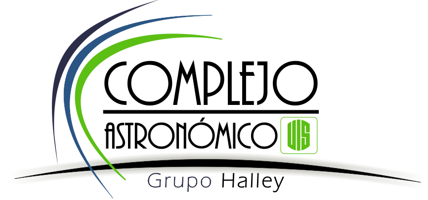
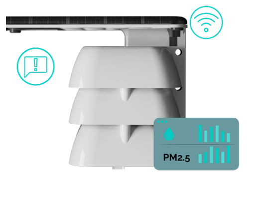

# Bienvenidos al Proyecto Móncora
> Clubes de ciencia para la adaptación al cambio climático

## ¿Qué es el Proyecto Móncora?

Móncora es un proyecto de ciencia ciudadana que busca formar  semilleros de ciencia  en los colegios de  Bucaramanga y con ello exponer tempranamente a los estudiantes de secundaria a ambientes y herramientas de investigación científica.

Este proyecto educativo se basa en la enseñanza del cambio climático  por medio del análisis de  datos meteorológicos de estaciones de bajo costo, con el objetivo  de identificar señales de contaminación y su correlación con los eventos de la vida cotidiana.

### Estaciones de monitoreo ambiental 

En cada una de las instuticiones educativas que hacen parte del proyecto se instalará una estación de monitoreo ambiental  [**MiniEVA**](https://makesens.co/), especialmente diseñada para medir la contaminación por partículas **PM1, PM2.5 y PM10**, pero también se pueden obtener mediciones de la **temperatura**, **presión** y  **humedad relativa** de la zona donde esté ubicada.

Con el proyecto Móncora tendremos una red de estaciones de monitorio de bajo costo, que constituirán una alternatica para monitorear la contaminación en la ciudad. El fin de semana del 24 al 27 de marzo de 2023 podimos verificar el funcionamiento de las estaciones corroborando la alerta sanitaria que emitio la AMB por la calidad del aire en Bucaramanga:

<blockquote class="twitter-tweet">
<a href="https://twitter.com/hashtag/Bucaramanga?src=hash&amp;ref_src=twsrc%5Etfw">#Bucaramanga</a> empezó el fin de semana con alertas ambientales y lo vimos en el proyecto de ciencia ciudadana <a href="https://twitter.com/hashtag/RACIMO?src=hash&amp;ref_src=twsrc%5Etfw">#RACIMO</a>-Moncora <a href="https://twitter.com/UIS?ref_src=twsrc%5Etfw">@UIS</a> <a href="https://twitter.com/lacongaphysics?ref_src=twsrc%5Etfw">@lacongaphysics</a> <a href="https://t.co/WYYi62jLQw">https://t.co/WYYi62jLQw</a> estudiantes de 4 colegios de Bga analizan la calidad del aire con datos de estaciones meteorológicas ➡️el hilo <a href="https://t.co/A1Tzoop5fG">https://t.co/A1Tzoop5fG</a>
&mdash; Planetario UIS (@halleyUIS) <a href="https://twitter.com/halleyUIS/status/1639784118085877761?ref_src=twsrc%5Etfw">March 26, 2023</a></blockquote> 

## ¿Cómo lo llevamos a cabo ? 

### :one: Preparación

Las actividades para esta etapa son:

- Contactar con las instituciones educaticas e invitarlas a participar en el proyecto. 
- Realizar el ajuste de hardware y software de las estaciones meteorológicas de los colegios, calibrarlas e instalarlas.
- Vincular las estaciones meteorológicas miniEva de los colegios a la nueva plataforma/repositorio EVA.
- Realizar la convocatoria interna para la conformación de los semilleros en los colegios de Bucaramanga y el Área Metropolitana.  Cada semillero debe componerse como mínimo de 1 docente y 5 estudiantes de los grados 9, 10 y 11, con los que se debe trabajar de 2 a 4 horas semanales.
- Elaborar el plan de trabajo de los semilleros y los contenidos de las sesiones semanales.- Actualizar la página web del proyecto, poblada con los contenidos del plan de trabajo de los semilleros: [página web](https://class.redclara.net/halley/moncora/intro.html).

### :two: Formación

Una vez formados los semilleros en los colegios, iniciará una etapa de capacitación a los estudiantes en la identificación de los fenómenos ambientales relacionados con variables climáticas. Estas capacitaciones serán realizadas por integrantes del Grupo Halley UIS. Este proceso se divide en cuatro módulos:
- Módulo 1: Ciencia ciudadana e introducción al cambio climático
- Módulo 2: Introducción a equipos de monitoreo ambiental
- Módulo 3: Introducción a Python
- Módulo 4: Procesamiento de datos

### :three: Práctica
 Cuando los miembros de los semilleros de investigación tenga la capacidad de trabajar con los datos de las estaciones meteorológicas, se llevará a cabo la realización de proyectos de investigación, donde los estudiantes apliquen el método científico y el conocimiento adquirido.

### :four: Divulgación

Finalizaremos con una  **Feria de la Ciencia** en la que todos los semilleros socialicen los resultados obtenidos en el desarrollo de sus proyectos con la comunidad local. 

## ¿Cómo puedes aportar?

- Si eres parte de una institución en Bucaramanga y/o Santander y quieres que lleguemos a tu institución ó  quires reproducir este proyecto en tu comunidad y quieres saber más de nuestra experiencia  puedes ponerte en contacto con <a href="mailto:halleyuis@uis.edu.co">nosotros </a>
- Si quires usar los datos meteorológicos de nuestra red de estaciones puedes encontrar más información en:
[Makesens](https://docs.makesens.co/help/)

## Agradecimientos

- Universidad Industrial de Santander
- La CongaPhysics
- Makesens
